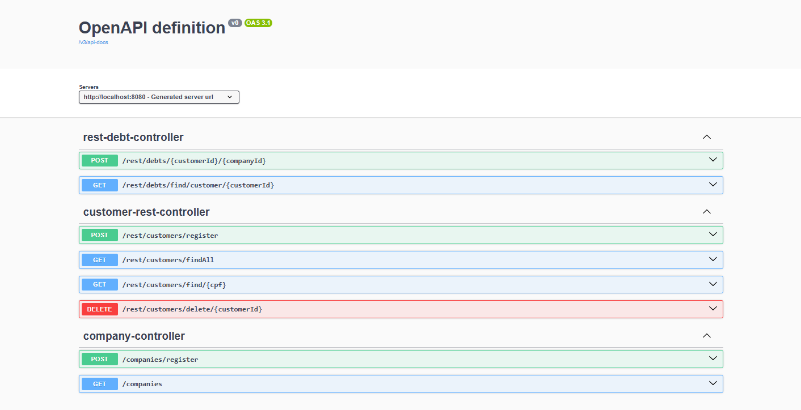
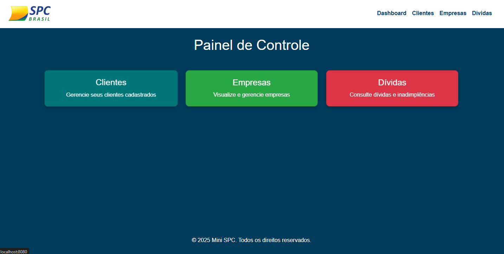
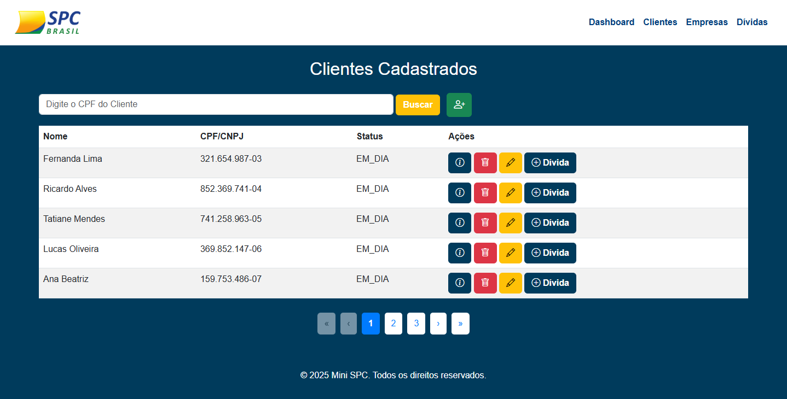
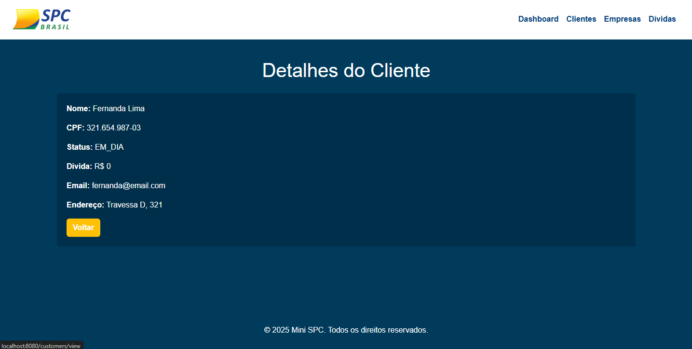
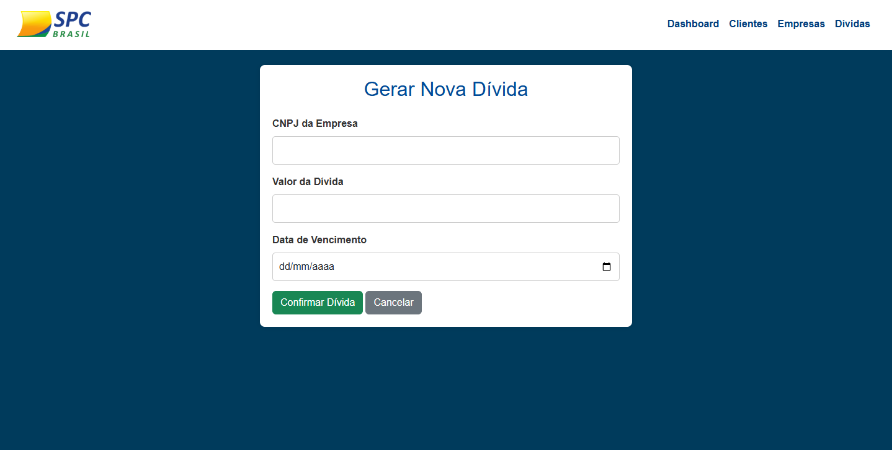

# Mini SPC

**Mini SPC** é um sistema de gerenciamento de **clientes**, **empresas** e **dívidas**, desenvolvido com **Spring Boot** e **PostgreSQL**. O sistema adota boas práticas de desenvolvimento, utilizando ferramentas modernas e seguindo os princípios **SOLID**, garantindo escalabilidade e manutenção eficiente.

## Tecnologias

Este projeto foi desenvolvido utilizando as seguintes tecnologias:

- **Spring Boot** - Framework para o desenvolvimento de aplicações Java.
- **PostgreSQL** - Banco de dados relacional utilizado para armazenar as informações.
- **JPA** (Java Persistence API) - Para mapear as entidades do banco de dados.
- **Lombok** - Biblioteca que reduz o código boilerplate no desenvolvimento.
- **Swagger** - Para documentação automática da API.
- **Collections** - Para manipulação eficiente de dados.
- **DTO (Data Transfer Objects)** - Para transferência de dados entre camadas.
- **MVC (Model-View-Controller)** - Padrão de arquitetura para separação de responsabilidades.
- **SOLID** - Princípios de design de software aplicados para garantir um código limpo e manutenível.

## Funcionalidades

O sistema **Mini SPC** oferece as seguintes funcionalidades principais:

- **Gerenciamento de Clientes**: Cadastro, atualização, exclusão e consulta de clientes.
- **Gerenciamento de Empresas**: Cadastro e consulta de empresas.
- **Gerenciamento de Dívidas**: Cadastro e consulta de dívidas associadas a clientes e empresas.
- **Paginação e Busca**: Implementação de paginação nas listagens de clientes e dívidas, além de filtros para facilitar a busca.

## Endpoints da API

### **Customers (Clientes)**

| Método | Rota                                | Descrição                                   |
|--------|-------------------------------------|---------------------------------------------|
| GET    | `/customers/view`                   | Listar todos os clientes                   |
| POST   | `/customers/created`                | Criar um novo cliente                      |
| GET    | `/customers/details?cpf={cpf}`      | Obter os detalhes de um cliente específico |
| PATCH  | `/customers/update/{customerId}`    | Atualizar os dados de um cliente específico|
| DELETE | `/customers/delete/{customerId}`    | Excluir um cliente específico              |

### **Companies (Empresas)**

| Método | Rota                                | Descrição                                   |
|--------|-------------------------------------|---------------------------------------------|
| POST   | `/companies/register`               | Criar uma nova empresa                     |
| GET    | `/companies`                        | Obter todas as empresas                    |

### **Debts (Dívidas)**

| Método | Rota                                | Descrição                                   |
|--------|-------------------------------------|---------------------------------------------|
| POST   | `/debts/{customerId}/create`        | Criar uma nova dívida para um cliente      |
| GET    | `/debts/list`                       | Listar todas as dívidas                   |

## Instalação

Para rodar o projeto localmente, siga os seguintes passos:

### Pré-requisitos

- **JDK 17 ou superior**
- **Maven**
- **PostgreSQL**

### Passos

1. Clone o repositório:

   ```bash
   git clone https://github.com/seu-usuario/mini-spc.git
   cd mini-spc
   ```

### Configure o banco de dados PostgreSQL:

Crie um banco de dados chamado `mini_spc` no PostgreSQL ou ajuste as configurações no arquivo `application.properties` para refletir as credenciais do seu banco de dados.

Exemplo de configuração no `application.properties`:

```properties
spring.datasource.url=jdbc:postgresql://localhost:5432/mini_spc
spring.datasource.username=seu_usuario
spring.datasource.password=sua_senha
spring.jpa.hibernate.ddl-auto=update
spring.jpa.properties.hibernate.format_sql=true
spring.jpa.properties.hibernate.dialect=org.hibernate.dialect.PostgreSQLDialect
```

### Executando a aplicação

Após configurar o banco de dados e garantir que todas as dependências estejam corretamente instaladas, siga os passos abaixo para executar a aplicação localmente.

#### Executando via Maven

1. Navegue até o diretório do projeto:

   ```bash
   cd /caminho/para/o/projeto
   ```

### Documentação Swagger

A documentação da API é gerada automaticamente pelo **Swagger**. Acesse a interface interativa para visualizar todos os endpoints, suas descrições e realizar testes diretamente na aplicação.



---

## Algumas Evidências

### Tela Dashboard

Esta é a tela principal do sistema, onde você pode ver uma visão geral das operações do **Mini SPC**, como clientes, empresas e dívidas.



### Tela de Listagem de Clientes

Aqui você pode visualizar todos os clientes cadastrados no sistema, com implementação da paginação, com a opção de editar, ver detalhes ou excluir cada um deles.



### Tela de Detalhes do Cliente

A tela de detalhes do cliente exibe todas as informações relacionadas a um cliente específico, permitindo uma visualização completa de seus dados.



### Tela de Criação de Dívida

Esta tela permite a criação de novas dívidas para clientes ou empresas. Nela, você pode inserir os dados necessários para registrar uma nova dívida no sistema.




